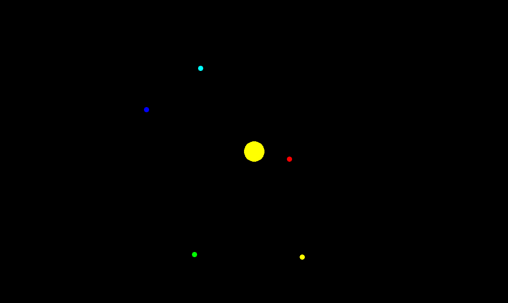

# Gravity Simulation
Simulating gravity in a solar system, using C++ and SFML

|  |  |
| --- | --- |
| Name | Gravity Simulation |
| Made in | May 2022 |
| Language used | C++ |
| Libraries used | SFML, cmath, vector, ctime |
| Programs used | VSCode |

## How to use
This program was compiled on Pop!-OS 22.04, using `gcc`. You may have to recompile it in order to run the program. If that is the case, you must need the `SFML` library installed.

To place a planet, point at some location with your mouse, and then press any mouse button.

---

All code was made by me.
